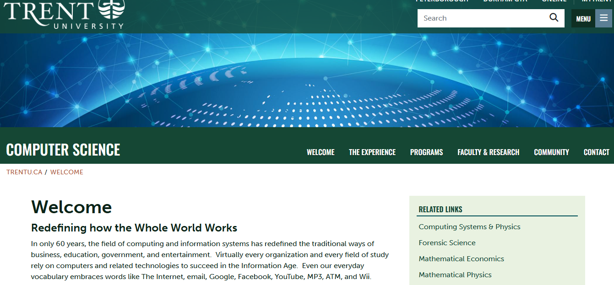

# Workshop 4

By Nuha Abdul Gafoor

## Emphasis

In only 60 years, the field of *computing and information systems* has redefined the traditional ways of business, education, government, and entertainment.  Virtually every organization and every field of study rely on computers and related technologies to succeed in the _Information Age_.  Even our everyday vocabulary embraces words like The Internet, email, Google, Facebook, YouTube, MP3, ATM, and Wii.

## Strong

The study of **computing and information systems** is central to our understanding of how the world processes, manages and communicates information using digital technologies.  As a student, you learn to build and use __computing and information systems__.  You learn to see things from a broader systems perspective and to develop integrated solutions that meet the needs of your users.  And you learn to appreciate the far-reaching cultural, ethical, and legal impact of digital systems.

It is hard to imagine a world without computing and information systems.  It is even harder to imagine our world in another 60 years.  New software products and new technologies continue to change our landscape almost daily.  Even the products and technologies of other fields could not be developed without the support of computing and information systems.  It is arguably the most revolutionary field of our lifetime and we extend a warm welcome to be part of our adventure. 

## Lists

### Unordered Lists

- List Item 1
- List Item 2
  - Sub Item 1
  - Sub Item 2
- List Item 3

### Ordered Lists

1. First Item
2. Second Item
    1. Sub Item One
    2. Sub Item Two
3. Third Item



## Hyperlinks

[COIS Department Website](https://www.trentu.ca/cois/)

## Including Code 

### Inline 

In HTML the `` tag is used to display pictures

### Code Fences

```html
<nav>
     <ul>
          <li><a href="index.html">Home</a></li>
          <li><a href="grid.html">Grid</a></li>
          <li><a href="https://trentu.ca">Trent</a></li>
          <li><a href="https://loki.trentu.ca">Loki</a></li>
        </ul>
     </nav>
```

```css
body {
  font-family: system-ui, -apple-system, BlinkMacSystemFont, "Segoe UI", Roboto,
    Oxygen, Ubuntu, Cantarell, "Open Sans", "Helvetica Neue", sans-serif;
  height: 100vh;
  display: flex;
  flex-direction: column;
}
```